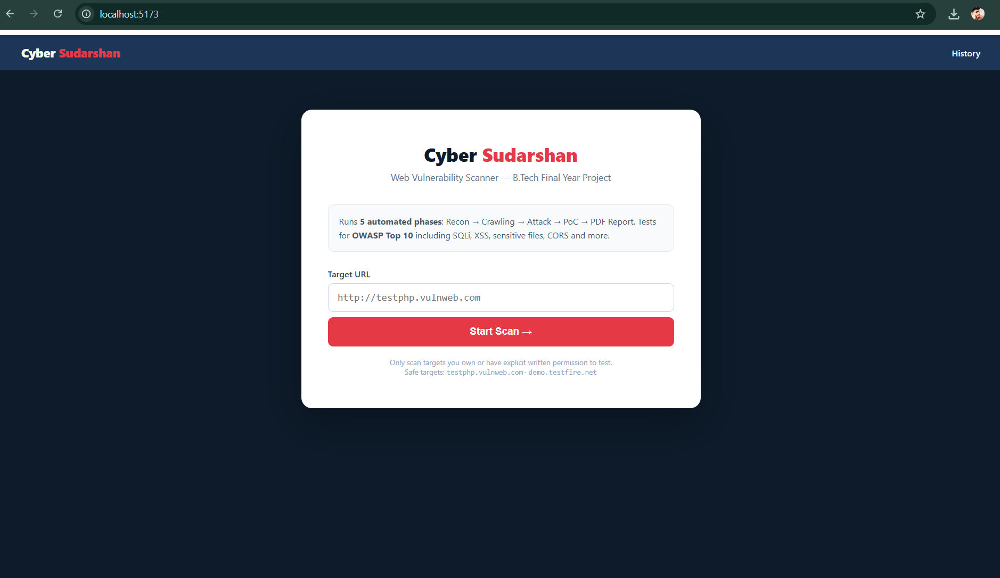
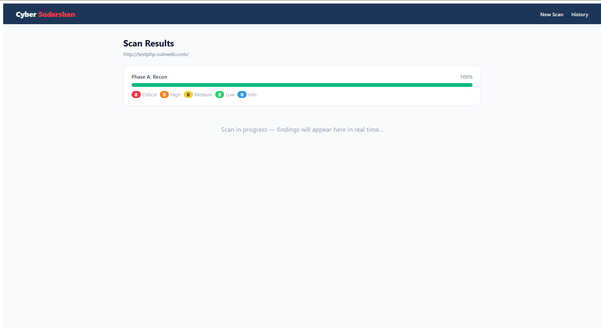

# 🛡️ Sudarshan-VMS

**Automated Vulnerability Management System** — a real-time, distributed Dynamic Application Security Testing (DAST) platform that scans, scores, and reports on web application security in minutes, not days.


> B.Tech Final Year Capstone Project — also submitted as an Internship Project to the Amroha Police Cyber Cell.

---

## 📑 Table of Contents

- [Overview](#-overview)
- [Screenshots](#-screenshots)
- [Key Features](#-key-features)
- [Tech Stack](#-tech-stack)
- [System Architecture](#-system-architecture)
- [Folder Structure](#-folder-structure)
- [Getting Started (Local Setup)](#-getting-started-local-setup)
- [Environment Variables](#-environment-variables)
- [Running a Scan](#-running-a-scan)
- [CLI / DevSecOps Usage](#-cli--devsecops-usage)
- [Deployment](#-deployment)
- [Disclaimer](#-disclaimer)
- [Future Scope](#-future-scope)

---

## 🔍 Overview

Sudarshan-VMS scans a target web application the same way an attacker would — actively probing for injection flaws, authentication weaknesses, and modern enterprise misconfigurations — while streaming results to the browser **live**, via WebSockets, instead of making the operator wait for a batch job to finish.

Findings are quantified into a single **Cyber Score (0–1000)** with an enterprise-style letter grade (A+ to F), and compiled into a professional, audit-ready PDF report with code-level remediation guidance for every issue found.

---

## 🖼️ Screenshots

> **Note:** Add your own screenshots here before publishing. Place image files inside a `docs/screenshots/` folder in the repo, then update the paths below. Recommended captures:
> 1. Dashboard / Target submission screen
> 2. Live Crawl Map in action during a scan
> 3. Scan Results page with severity breakdown
> 4. A sample page from the generated PDF report
> 5. The Cyber Score gauge / grade view

| Dashboard | Live Crawl Map |
|---|---|
| `docs/screenshots/dashboard.png` | `docs/screenshots/crawl-map.png` |

| Scan Results | PDF Report |
|---|---|
| `docs/screenshots/results.png` | `docs/screenshots/pdf-report.png` |

```markdown
<!-- Once images are added, replace the table above with: -->




```

**How to capture:** open the live app, use `Win + Shift + S` (Windows Snipping Tool) to grab each screen, save as PNG into `docs/screenshots/`, then commit and push.

---

## ✨ Key Features

- ⚡ **Real-time scan telemetry** — live progress, phase updates, and findings streamed via Socket.io
- 🕸️ **Live Crawl Map** — force-directed visualization of discovered endpoints; high-severity nodes glow red
- 🔎 **29+ vulnerability checks** across four module families:
  - Recon & Information Leakage (sensitive file discovery, GraphQL introspection, passive Google Dorking)
  - Advanced Injection Fuzzers (SQLi, XSS, Command Injection, SSTI, XXE, CRLF, NoSQL Injection)
  - Protocol & Auth Security (broken auth, JWT `alg:none`, OAuth misconfig, CORS, Host header injection)
  - Modern Enterprise Flaws (HTTP request smuggling, DNS rebinding, cache poisoning, rate-limit bypass)
- 📊 **Cyber Score Algorithm** — weighted 0–1000 risk score with A+ to F enterprise grading
- 📄 **Audit-ready PDF reports** — cover page, executive summary, severity chart, clickable table of contents, page numbers, and per-finding remediation snippets
- 🖥️ **DevSecOps CLI** — `cli.py --fail-on Critical` integrates directly into CI/CD pipelines to block insecure builds
- 🔐 **JWT-based authentication** for multi-user access and scan history

---

## 🧰 Tech Stack

| Layer | Technology |
|---|---|
| Frontend | React.js (Vite), Tailwind CSS, Axios, Socket.io-client |
| Backend | Node.js, Express, Mongoose, Socket.io, JWT |
| Database | MongoDB (Atlas) |
| Scanning Engine | Python 3.x, `concurrent.futures` (multi-threading), Requests, BeautifulSoup |
| Reporting | ReportLab (PDF generation) |
| Deployment | Vercel (frontend) · Render / Docker (backend + engine) · MongoDB Atlas (database) |

---

## 🏗️ System Architecture

```
+-------------------------------------------------------------+
|               FRONTEND (React.js / Vite)                    |
|   - Target submission UI    - Live Crawl Map                |
|   - Cyber Score visualization                                |
+------------------------------+------------------------------+
                               | HTTP (REST) + WebSocket (Socket.io)
                               v
+-------------------------------------------------------------+
|               BACKEND (Node.js / Express)                   |
|   - API Gateway & Auth        - Scan Queue Manager           |
|   - MongoDB Persistence       - Subprocess Orchestration     |
+------------------------------+------------------------------+
                               | child_process.spawn()
                               v
+-------------------------------------------------------------+
|               SCANNING ENGINE (Python)                      |
|   - Phase A: Recon (passive + active)                       |
|   - Phase B: Injection & Auth fuzzing (multi-threaded)       |
|   - Phase C: Report Generation (PDF)                        |
+-------------------------------------------------------------+
```

**Data flow:** Target submitted → backend creates a MongoDB scan record → Python engine spawned as a subprocess → engine streams line-delimited JSON over `stdout` → backend relays each event to the client via Socket.io → findings persisted → final PDF compiled and saved.

---

## 📁 Folder Structure

```
vuln-scanner/
├── frontend/          # React (Vite) UI
│   └── src/
│       ├── pages/      # Login, Scan, Results, History
│       └── context/    # Auth context
├── backend/           # Node.js / Express API + Socket.io
│   ├── models/         # Mongoose schemas (User, Scan)
│   ├── routes/         # /api/auth, /api/scans
│   └── queue.js         # Spawns & monitors the Python engine
├── engine/             # Python scanning engine
│   ├── phases/          # recon, attack, reporter, etc.
│   ├── reports/          # Generated PDF output
│   └── requirements.txt
└── Dockerfile          # Combined Node + Python runtime (for deployment)
```

---

## 🚀 Getting Started (Local Setup)

### Prerequisites
- Node.js 18+ and npm
- Python 3.10+
- A MongoDB instance (local or [MongoDB Atlas](https://www.mongodb.com/cloud/atlas))

### 1. Clone the repository
```bash
git clone https://github.com/<your-username>/vuln-scanner.git
cd vuln-scanner
```

### 2. Set up the backend
```bash
cd backend
npm install
```
Create a `.env` file in `backend/` (see [Environment Variables](#-environment-variables) below).

### 3. Set up the Python engine
```bash
cd ../engine
python -m venv venv
venv\Scripts\activate        # Windows
# source venv/bin/activate   # macOS/Linux
pip install -r requirements.txt
```

### 4. Set up the frontend
```bash
cd ../frontend
npm install
```

### 5. Run all three (separate terminals)
```bash
# Terminal 1 — backend
cd backend && node server.js

# Terminal 2 — frontend
cd frontend && npm run dev
```
Open the URL Vite prints (usually `http://localhost:5173`).

---

## 🔑 Environment Variables

Create `backend/.env`:

```env
MONGO_URI=mongodb://localhost:27017/vuln-scanner
JWT_SECRET=replace_with_a_strong_random_secret
PORT=5000
PYTHON_PATH=python
```

> ⚠️ Generate a strong `JWT_SECRET` with:
> `node -e "console.log(require('crypto').randomBytes(32).toString('hex'))"`
> Never commit `.env` to GitHub — it is already excluded via `.gitignore`.

For the frontend, create `frontend/.env`:
```env
VITE_API_URL=http://localhost:5000
```

---

## 🎯 Running a Scan

1. Register / log in through the frontend.
2. Enter a target URL on the **Scan** page and submit.
3. Watch the **Live Crawl Map** and progress bar update in real time.
4. Once complete, view findings on the **Results** page or download the generated **PDF report** from `engine/reports/`.

> ⚠️ Only scan targets you own or have **explicit written authorization** to test. See [Disclaimer](#-disclaimer).

---

## 🖥️ CLI / DevSecOps Usage

The scanning engine can also be invoked directly, independent of the web UI — useful for CI/CD pipelines:

```bash
python engine/cli.py --target https://your-target.com --fail-on Critical
```

`--fail-on Critical` returns a non-zero exit code if any Critical-severity finding is detected, allowing the scan to act as a quality gate in a GitHub Actions / CI pipeline (see `engine/github_action/action.yml` for a reference workflow).

---

## ☁️ Deployment

| Component | Platform |
|---|---|
| Frontend | [Vercel](https://vercel.com) |
| Backend + Python Engine | [Render](https://render.com) (Docker runtime) |
| Database | [MongoDB Atlas](https://www.mongodb.com/cloud/atlas) |

The repository includes a root-level `Dockerfile` that bundles Node.js and Python together so the backend can spawn the scanning engine in production exactly as it does locally. See the `backend/queue.js` `PYTHON_PATH` environment variable for cross-platform compatibility.

---

## ⚖️ Disclaimer

Sudarshan-VMS is built strictly for **authorized security testing and educational purposes**. Do not scan any system without **explicit, written permission** from its owner. Unauthorized scanning of third-party systems may violate the Information Technology Act, 2000 (India) and other applicable laws. The authors accept no liability for misuse of this tool.

---

## 🔮 Future Scope

- AI-assisted automated patch generation for identified vulnerabilities
- Authenticated / credentialed scanning for logged-in application surfaces
- Cloud storage misconfiguration checks (S3, Azure Blob, GCS)
- Expanded compliance mapping for Indian government & critical-infrastructure entities

---

<p align="center"><i>Built as part of a B.Tech Final Year Capstone Project.</i></p>
